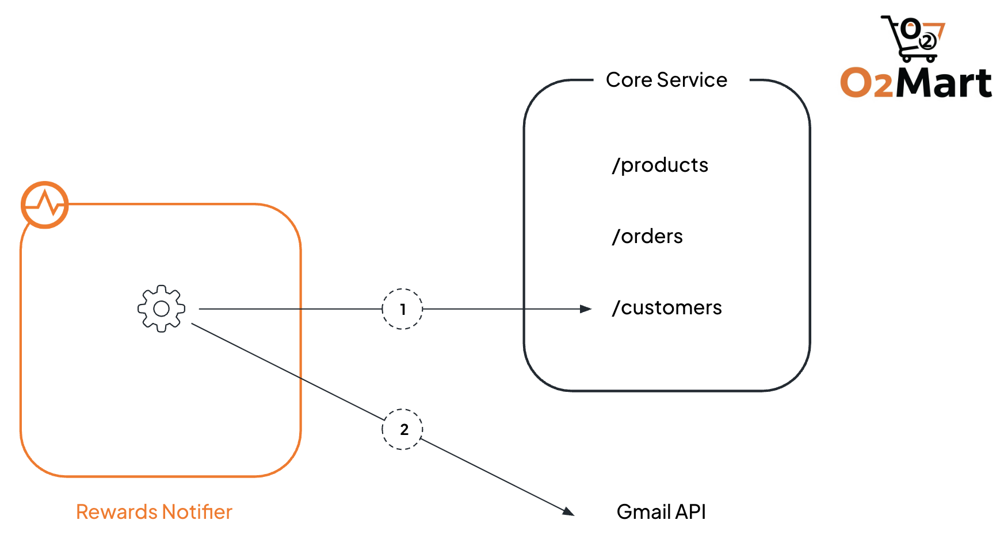
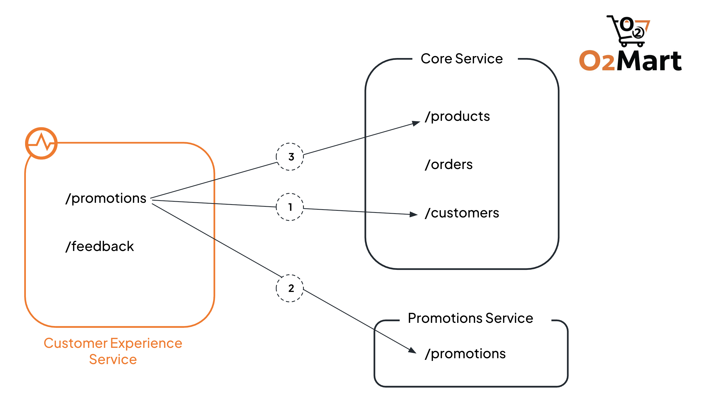

# Session 1

## Backends 

- O2Mart Core Backend

    ```
    https://10717d68-0b05-4594-95ed-2f4f1c0c26b6-dev.e1-us-east-azure.choreoapis.dev/default/o2mart-core-service/v1.0
    ```

- O2Mart Promotions Service OpenAPI specification - [o2martpromotions_openapi.yaml](./o2martpromotions_openapi.yaml)


## Automation

### Overview



This session is based on the O2Mart sample scenario and will guide you through an Automation example. The following key steps will be covered:
1. Creating an HTTP connection to the /customers resource and iterating through the list of customers and filtering those with 5,000 or more loyalty points.
2. Sending exclusive offer email using the Gmail connector.


Following json can be used to generate type.

   ```json
   [
     {
       "id": "C001",
       "name": "Clara Zhang",
       "email": "clara@sample.net",
       "phone": "555-345-6789",
       "loyalty": {
         "points": 2800,
         "expiryDate": "2026-08-31"
       }
     },
     {
       "id": "C002",
       "name": "Brian Holt",
       "email": "brian@test.org",
       "phone": "555-234-5678",
       "loyalty": {
         "points": 750,
         "expiryDate": "2025-09-31"
       }
     }
   ]
   ```

Following can be used for `MessageRequest`

```
{
    to: [customer.email],
    subject: "O2 Mart - Exclusive offer for loyalty points",
    bodyInText: string `Hello ${customer.name}, 
Congratulations! You have earned special exclusive offer for accumulating ${customer.loyalty.points} loyalty points.`
}
```

## Integration as an API

### Overview

Implementation of a REST API for a customer experience service, for the fictional O2Mart, with the following endpoints.

1. `/promotions` - retrieve promotions available to the customer based on their loyalty points
2. `/feedback` - submit feedback for a particular order

#### Promotions

This scenario demonstrates:
 
- working with different data types and formats in Ballerina 
  - data transformation and mapping
  - generating strong types from JSON and XML values
- generating and using connections based on OpenAPI specifications
- using the Copilot to generate integrations/parts of an integration
- introducing tests for the implementation



The promotion endpoint should accept GET requests with `customerId` as a query parameter and respond with applicable promotions in the following format.

```json
[
  {
    "productId": "P1001",
    "label": "Mooberry Whole Milk 1L - 10% OFF!",
    "originalPrice": 2.49,
    "discountedPrice": 2.24,
    "validUntil": "Until August 1"
  },
  {
    "productId": "P1005",
    "label": "PureSalt Crystal Salt 1kg - 5% OFF!",
    "originalPrice": 0.99,
    "discountedPrice": 0.94,
    "validUntil": "Until August 4"
  }
]
```

The integration is as follows.

1. Retrieve the customer details from the `customers` endpoint of the core backend using `customerId` as a path parameter - `/customers/{customerId}`

    The response will be in the following format.

    ```json
    {
        "id": "C001",
        "name": "Alice Fern",
        "email": "alice@example.com",
        "phone": "555-123-4567",
        "loyalty": {
            "points": 7500, 
            "expiryDate": "2025-07-31"
        }
    }
    ```

2. Extract the loyalty points from the response and use it as a query parameter (`loyalty`) in a call to the promotions service to retrieve promotions relevant to the user based on their loyalty points. 

    Generate a local connection based on the [OpenAPI specification](./o2martpromotions_openapi.yaml) of the promotions service. 
    
    The response will include the IDs of the products for which promotions apply with promotion details.

    ```json
    [
        {
            "productId": "P1001",
            "percentage": 10,
            "ends": "2025-08-01"
        },
        {
            "productId": "P1005",
            "percentage": 5,
            "ends": "2025-08-04"
        }
    ]
    ```

3. For each product in the promotions list

    i. retrieve the product details from the core service.

    > For demonstration, we assume a small number of products and retrieve product details one at a time.

    Use the product ID as a path parameter - `/products/{promotion.productId}` - and retrieve product details.

    ```xml
    <product id="P1001">
        <name>Mooberry Whole Milk 1L</name>
        <price>2.49</price>
        <stock>120</stock>
    </product>
    ```

    ii. Use the promotion details and the product details to produce output in the expected format.

    Try using 
    - AI-assisted data mapping
    - AI-assisted code generation to generate a function that accepts a date in the format of "2025-08-04" and produces a string with just the month and the day "August 4"

        ```
        Define a function that accepts a date in the format of "2025-08-04" and produces a string with just the month followed by the day "August 4"
        ```

You can test the integration with sample customer IDs - `C001` to `C007`

Also try generating tests via the Copilot.

#### Feedback

This scenario demonstrates:
 
- incorporating LLM calls into your integrations
- using published connectors to work with 3rd-party apps (`gmail`)
- working with databases


The feedback endpoint should accept POST requests with the `orderId` and the `feedback` (both string) fields in the payload. Analyze the feedback using an LLM, and if the sentiment of the feedback is negative send an email to management including the details.

Sample request payload:

```json
{
  "orderId": "O1003",
  "feedback": "Great experience, fast delivery and well-packaged items."
}
```

1. Analyze the customer feedback using an LLM, to identify the sentiment, applicable products, and applicable categories.

    ```ballerina
    type FeedbackAnalysis record {|
        # The sentiment of the feedback
        Sentiment sentiment;
        # Comma separated list of applicable categories out of product quality, packaging, and/or delivery
        string categories;
        # Comma separated list of applicable product(s)
        string products;
    |};
    ```

2. Update the feedback, along with the categories and products identified, in a database.

    ```sql
    INSERT INTO feedback (order_id, feedback, sentiment, categories, products)
        VALUES (${payload.orderId}, ${payload.feedback}, ${feedbackAnalysis.sentiment}, 
                ${feedbackAnalysis.categories}, ${feedbackAnalysis.products})
    ```

3. If the sentiment is negative, send an email to a configured email address notifying of the negative feedback, including some details.

Sample feedback to try with:

```json
{
    "orderId": "O1001",
    "feedback": "Loved the fast delivery and the packaging was neat. The milk was fresh too!"
}
```

```json
{
    "orderId": "O1005",
    "feedback": "The noodles were crushed and one of the items was missing from the box."
}
```

```json
{
    "orderId": "O1004",
    "feedback": "The delivery was okay. Products were as expected."
}
```

```json
{
    "orderId": "O1002",
    "feedback": "I was quite disappointed with this order. It took significantly longer to arrive than expected, which was already frustrating. On top of that, the cereal box was visibly damaged when it was delivered — the top corner was crushed, and it looked like it had been handled roughly. This really affected the overall experience, and I’m hesitant to order again if packaging and delivery times aren’t improved."
}
```

